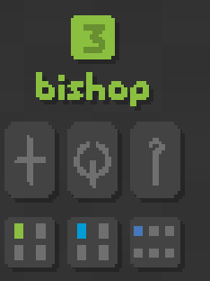
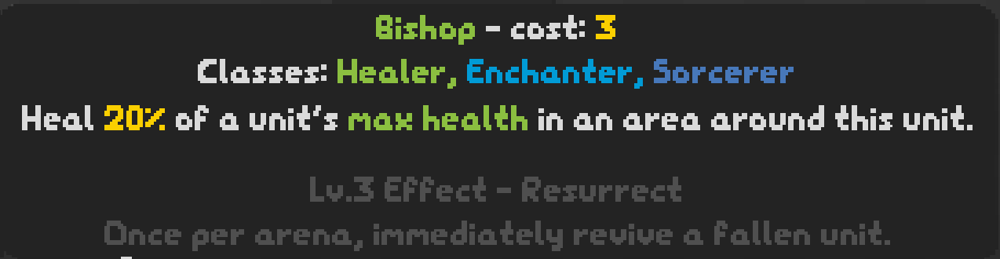
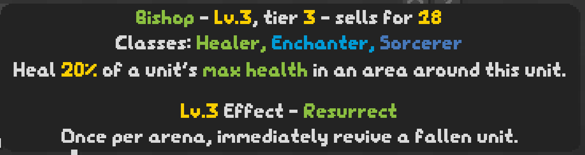

# SNKMD

This is a *very* work in progress modloader for [SNKRX](https://store.steampowered.com/app/915310/SNKRX/), an arcade shooter roguelite where you control a snake of heroes that automatically attack nearby enemies.
Combine different heroes to unlock class bonuses and create unique builds, and steer your unstoppable party as they ravage through endless waves of enemies.

## About

I recently bought SNKRX and after playing a few times, I got a little bored of the repitition. That's why I decided to create a modloader. This repository is a patched version of the [SNKRX source](https://github.com/a327ex/SNKRX). I hope for it to be similar to Forge for Minecraft. An API will be provided that will make creating things like units, classes, and enemies much easier (the organization of SNKRX's code is a *little* messy).

## Wiki

Wiki will be coming soon, after the API is finished.

## Creating Mods

Mods are distributed as .zip files placed in the `mods/` folder in the SNKRX save location (`C:\Users\<user>\AppData\Roaming\LOVE\SNKRX\mods` or `~/.local/share/love/SNKRX/mods`). The modloader then unpacks this zip file into a folder on its first load.

To develop a mod, the first file you need is `mod_data.txt`. This file should go in the root of your mod's directory. The simplest example of this file is as follows:
```
name=ExampleMod
main=main.lua
```

`name=` is the name of your mod, and `main=` is the path to the file that is executed on game launch

An example mod can be found [here](https://github.com/sharpdev-me/SNKMD-Example).

<hr/>

## Current Plans

- A little more effort in reworking the code to support modded units
- Custom classes
- Create an API, similar to how programs like tModLoader and Forge work
- Create a wiki for mod developers

## Mod Ideas

I need to know what I need to implement in the API, so please let me know about any ideas you have! You can either send me a message on Discord (SharpDev#1101), or you can open an Issue here on GitHub. Thank you!

<hr/>

## Running

### Windows
Download and unzip the repository with a program like WinRar or 7-Zip, then double-click on `launch_game.bat`. You need to have Steam running to launch the game.

### Linux
First, install [LÖVE](https://love2d.org). You'll need to have `libsteam_api.so` ready from the [Steamworks SDK](https://partner.steamgames.com/doc/sdk). Take a look at all the DLLs in `engine/love/` to see what libraries you need to have installed. You can then run `love --console .` to run LOVE in the current directory to launch the game.

## Screenshots
A modded unit, the Bishop, displayed in the shop



The player hovering their mouse over the Bishop


The player hovering their mouse over the Bishop at level 3


## LICENSE

All assets have their specific licenses and they are linked to in the game's credits. All code is under the MIT license.
